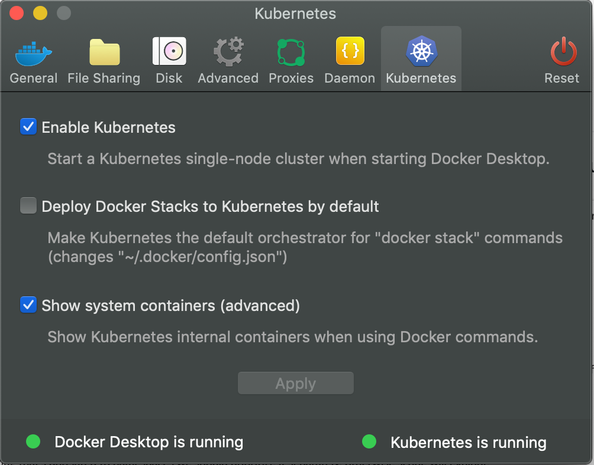

## Prerequisites
* Docker for Desktop installed: https://www.docker.com/products/docker-desktop
* Helm v3 installed: https://helm.sh/docs/intro/install/
* Kubectl installed: https://kubernetes.io/docs/tasks/tools/install-kubectl/
* Consul cli installed: https://www.consul.io/downloads.html

## Ensure your Kubernetes cluster is working
1. Go into the settings of Docker for Desktop and ensure that the built-in Kubernetes
  cluster is running.
  
  
  
1. Ensure you're in the right `kubectl` context:
    ```sh
   kubectl config current-context
   docker-desktop
    ```
1. If you're not, run
    ```sh
   kubectl config use-context docker-desktop
    ```
1. Check that the nodes are as expected
    ```sh
   kubectl get node
   NAME             STATUS   ROLES    AGE     VERSION
   docker-desktop   Ready    master   3h22m   v1.14.8
    ```
1. If you wanna be cool, alias `kubectl` to `k`
    ```sh
   alias k=kubectl
    ```

## Workshop Overview
1. [Deploy a test application](test-application.md)
1. Install Consul on Kubernetes using the Consul Helm Chart
1. Configure connect injection for that test application
1. Do a canary deployment for that test application
1. Bonus exercises:
    1. Configure metrics for the application

**NOTE:** This workshop will require problem solving! Everything won't work
perfectly, you'll need to figure things out for yourself. If you need help,
check the collapsible "Hint" sections.
