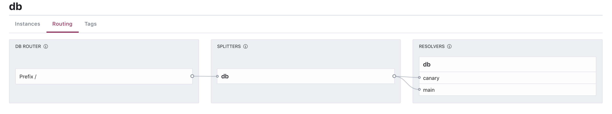

## Canary Deployment

Canarying is a deployment strategy where we bring up a small number of
new instances of a new version of our application, route a small amount of traffic
to the new version and monitor them closely.

If the metrics indicate that the canary is dead, we immediately evacuate the mine (read: roll back the deployment).

In our workshop today, we're going to deploy a canary version of our `db` service.

## L7 Configs

We're going to deploy a single new instance of our `db` service.


**📝Exercise: which L7 configs
do we need to ensure no traffic is routed to it (at first) until we purposely send
traffic there?**

<details>
<summary>Hint</summary>

1. `service-defaults` that sets the protocol to `http`
1. `service-resolver` that defines the subsets
1. `service-splitter` that ensures 0% of the traffic routes to the canary deployment (for now)

</details>


```shell
cat <<EOF > db-service-defaults.hcl
kind = "service-defaults"
name = "db"
protocol = "http"
EOF
```

```shell
cat <<EOF > db-service-resolver.hcl
kind           = "service-resolver"
name           = "db"
default_subset = "main"
subsets = {
  "main" = {
    filter = "Service.Meta.canary != \"true\""
  }
  "canary" = {
    filter = "Service.Meta.canary == \"true\""
  }
}
EOF
```

```shell
cat <<EOF > db-service-splitter.hcl
kind           = "service-splitter"
name           = "db"
splits = [
  {
    weight         = 100
    service_subset = "main"
  },
  {
    weight         = 0
    service_subset = "canary"
  },
]
EOF
```

**Now we need to apply these configs, how do we do that?**

<details>
<summary>Hint</summary>

* `port-forward` to a Consul server/client and use `consul config write` from our laptops
* OR `kubectl cp` the configs to a pod in the cluster and use `consul config write` from there

</details>


## Apply Initial Configs

In one Terminal, port-forward to the Consul server:

```shell script
kubectl port-forward consul-consul-server-0 8500
```

In another terminal, write the configs:

```shell script
consul config write db-service-defaults.hcl
consul config write db-service-resolver.hcl
consul config write db-service-splitter.hcl
```

If you go to the UI and click on the `db` service you should see the splitter
(with a bug for the weight if you hover over the canary line).



If you run the curl, things should be working as before:

```shell script
kubectl exec debug -- curl -sS web

{
  "name": "Service",
  "uri": "/",
  "type": "HTTP",
  "ip_addresses": [
    "10.1.0.154"
  ],
  "start_time": "2020-05-04T17:06:09.219122",
  "end_time": "2020-05-04T17:06:09.230689",
  "duration": "11.5674ms",
  "body": "Hello World",
  "upstream_calls": [
    {
      "name": "Service",
      "uri": "http://localhost:8080",
      "type": "HTTP",
      "ip_addresses": [
        "10.1.0.152"
      ],
      "start_time": "2020-05-04T17:06:09.226956",
      "end_time": "2020-05-04T17:06:09.227076",
      "duration": "120.7µs",
      "body": "db",
      "code": 200
    }
  ],
  "code": 200
}
```

## Deploy the canary
We're ready to deploy our canary. If we edited our `db-deployment.yaml` and ran
`kubectl apply`, Kubernetes would clobber the existing deployment so we need to
duplicate that file and give the deployment a new name:

```shell script
cp db-deployment.yaml db-canary-deployment.yaml
```

Edit `db-canary-deployment` and:
1. Change its names to `db-canary`
1. Change its replicas to 1
1. Add an annotation `consul.hashicorp.com/service-meta-canary: "true"`
1. Change the response to "db canary" so we know when we're calling it.

```yaml
apiVersion: apps/v1
kind: Deployment
metadata:
  name: db-canary # CHANGE
  labels:
    app: db-canary # CHANGE
spec:
  replicas: 1 # CHANGE
  selector:
    matchLabels:
      app: db-canary # CHANGE
  template:
    metadata:
      labels:
        app: db-canary # CHANGE
      annotations:
        "consul.hashicorp.com/connect-inject": "true"
        "consul.hashicorp.com/connect-service": "db" # DON'T CHANGE
        "consul.hashicorp.com/service-meta-canary": "true"
    spec:
      containers:
        - name: my-first-container-name
          image: nicholasjackson/fake-service:v0.7.8
          ports:
            - containerPort: 9090
          env:
          - name: MESSAGE
            value: "db canary" # CHANGE
          - name: LISTEN_ADDR
            value: "127.0.0.1:9090"
```

Let's deploy the canary:

```shell script
kubectl apply -f db-canary-deployment.yaml
deployment.apps/db-canary created
```

```shell script
kubectl rollout status deployment/db-canary --watch
deployment "db-canary" successfully rolled out
```

Our web service shouldn't be routing to it. Let's check by running the `curl`
multiple times:

```shell script
for i in 1 2 3 4 5; do kubectl exec debug -- curl -sS web | grep 'body": "db'; done
      "body": "db",
      "body": "db",
      "body": "db",
      "body": "db",
      "body": "db",
```

## Actually canary
Now we're ready to route 20% of traffic to our canary.

**How do we do that?**

<details>
<summary>Hint</summary>

Modify the service-splitter and change the weights.

</details>

Edit `db-service-splitter.hcl` to:

```hcl
kind           = "service-splitter"
name           = "db"
splits = [
  {
    weight         = 80
    service_subset = "main"
  },
  {
    weight         = 20
    service_subset = "canary"
  },
]
```

Write it:

```shell script
consul config write db-service-splitter.hcl
```

Now let's test that it's working:

```shell script
for i in 1 2 3 4 5; do kubectl exec debug -- curl -sS web | grep 'body": "db'; done
      "body": "db canary",
      "body": "db",
      "body": "db",
      "body": "db",
      "body": "db",
```

(there's a 32.768% chance that you'll need to run this again to see the canary response)

## Finish Up
Nice work! Virtual high-five your partner.

In the real-world, the next step would be to fully deploy the canary version but we're going to stop it there for today!
